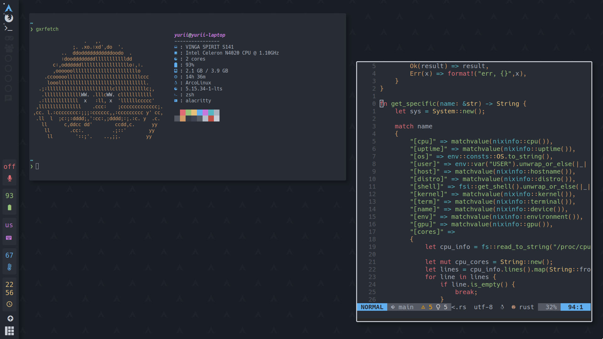
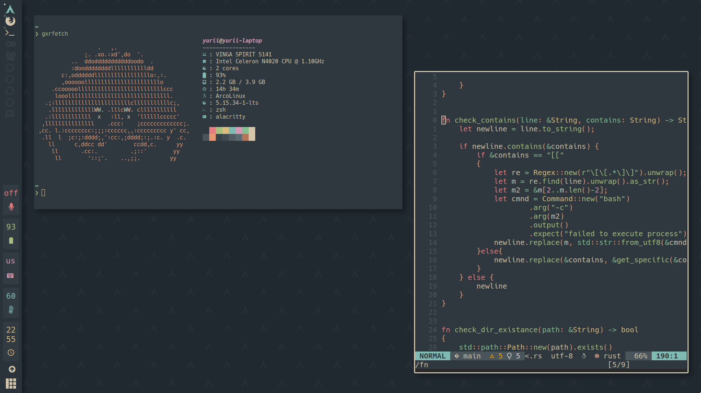
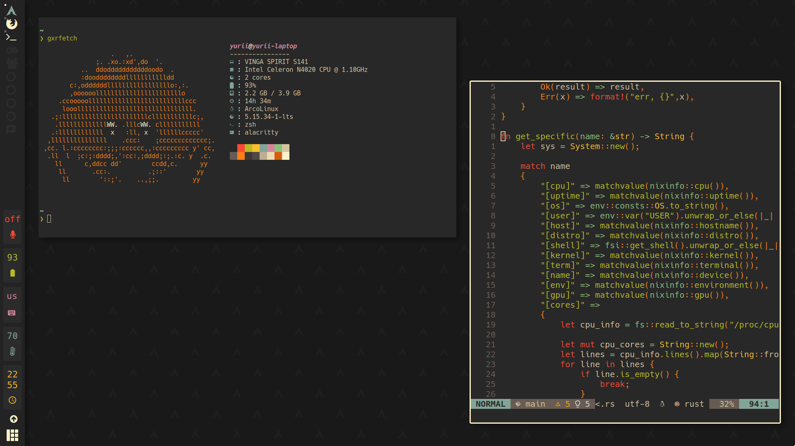

# Goxore's linux dotfiles







## Installation

Clone the repo anywhere you like, you can apply any config files directly from the repo folder using [GNU Stow](https://www.gnu.org/software/stow/).

example:
```bash
stow lf
```

Before doing it, you might want to rename/move your dotfiles so you don't mess up anything.

This will create a symlink from the repo folder to your ~/.config directory.

## Usage

Some of the scripts from /scripts are <s>stolen</s> borrowed from other people's dotfiles, feel free to take anything you like.

Most of my config files look for ~/scripts directory for scripts.

## colorscheme

I'm using Base16 and [flavours](https://github.com/Misterio77/flavours), so make sure to create symlinks for
flavours and local to have dynamic colorschemes for most programs.

[more info](https://www.yuriimeln.xyz/posts/easyricebase16) on how to make a beautiful rice.
